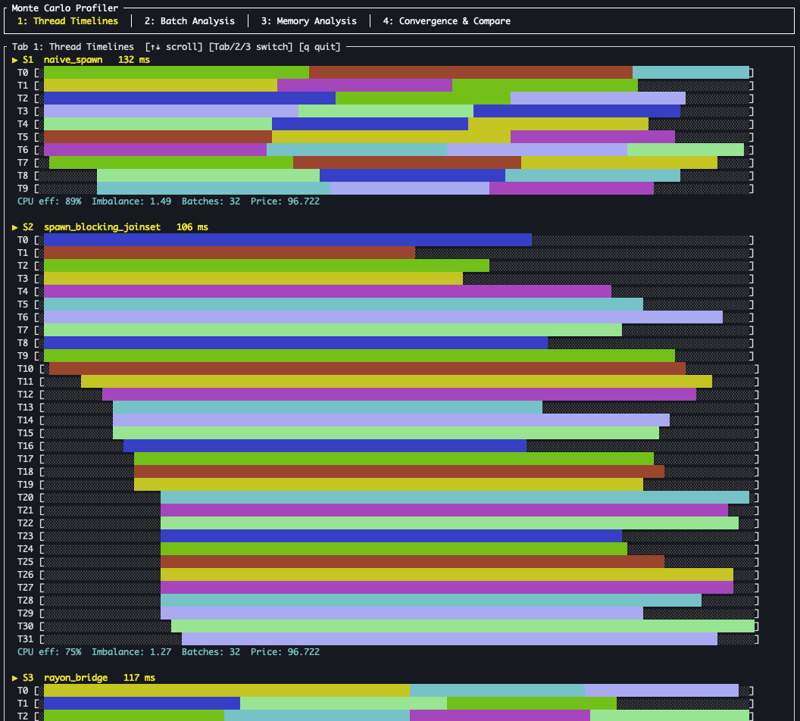
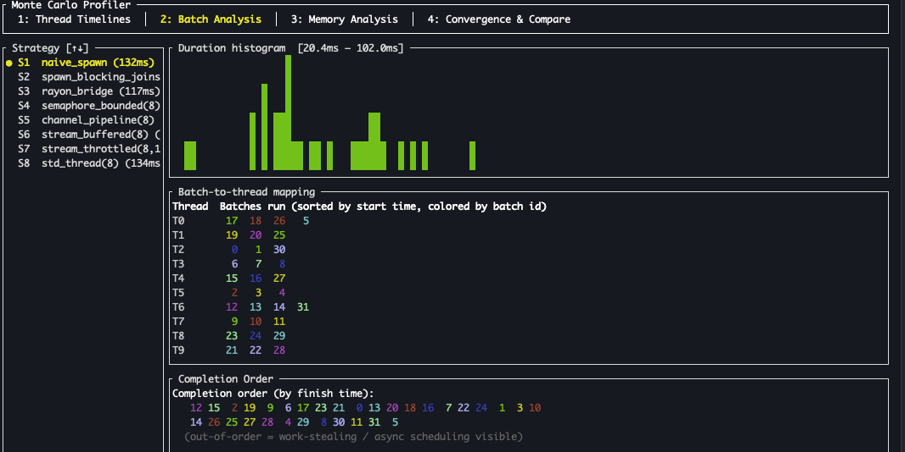
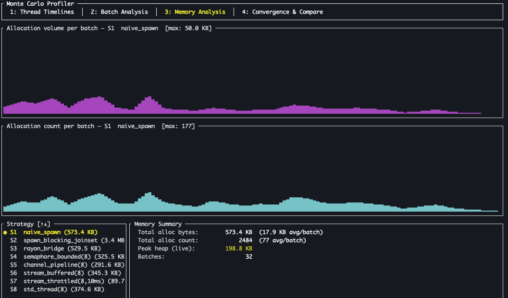
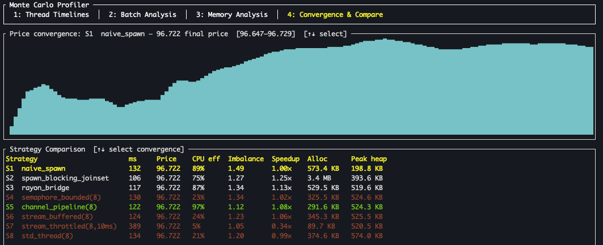
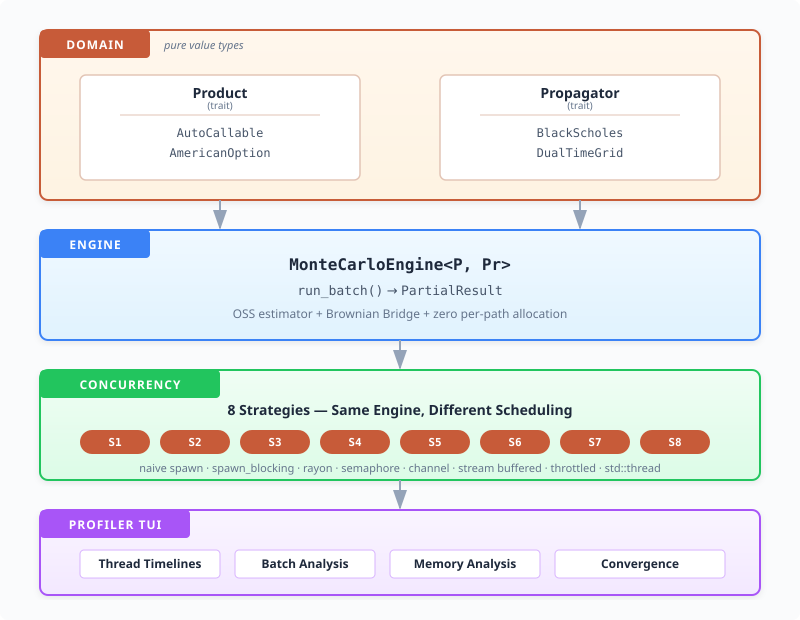

# Monte Carlo Auto-Callable Pricing Engine — Hybrid Runtime

A high-performance structured-product pricing engine written in Rust, demonstrating how to build a correct-from-the-start Monte Carlo framework around three core abstractions — **Product**, **Propagator**, and **Engine** — with emphasis on memory layout, CPU efficiency, and cloud-friendly parallelism.

This branch (`feature/hybrid-runtime`) experiments with a **single hybrid concurrency architecture**: a Tokio controller for orchestration paired with a Rayon worker pool for CPU-bound batch execution. The branch is organised so each optimisation lands as a new **variant** of the same architecture and is profiled side-by-side against the existing baseline.

The instrument priced is an **autocallable note with daily knock-in monitoring and monthly knock-out (autocall) observations**, valued with the Glasserman-Staum one-step survival technique.

---

## Quick Start

```bash
# Build optimised binary (fat LTO, codegen-units=1)
cargo build --release

# Run the benchmark harness (all known variants)
cargo run --release

# Run a specific variant or override path count
cargo run --release -- --npaths 2_000_000 baseline

# Launch the post-run profiler TUI
cargo run --release --bin profiler

# Profiler with 64 batches (exposes work-stealing more clearly)
cargo run --release --bin profiler -- --nbatches 64
```

Sample benchmark output:

```
╔══════════════════════════════════════════════════════════════════════════╗
║    HSBC Monte Carlo Auto-Callable Pricing Engine — Hybrid Runtime        ║
╚══════════════════════════════════════════════════════════════════════════╝

  Architecture: tokio controller + rayon worker pool
  Instrument  : Autocallable note, maturity = 1Y
  S_0         : 100, σ = 25%, r = 5%, q = 2%
  Barriers    : Call = 100% of S_0, KI = 70% of S_0
  Grid        : 12 monthly x 21 daily sub-steps
  Paths       : 200000, Threads = 8
  Method      : One-Step Survival (Glasserman-Staum) + Brownian Bridge

  Running rayon_bridge_baseline          ... 130 ms  price = 96.734

╔════════════════════════════════╦══════════╦═══════════╦══════════╦══════════════════╦═════════╗
║ Strategy                       ║    Paths ║ Time (ms) ║    Price ║      95% CI      ║ Speedup ║
╠════════════════════════════════╬══════════╬═══════════╬══════════╬══════════════════╬═════════╣
║ rayon_bridge_baseline          ║     200K ║       130 ║   96.734 ║ [ 96.71, 96.76] ║    1.0× ║
╚════════════════════════════════╩══════════╩═══════════╩══════════╩══════════════════╩═════════╝

── AmericanOption stub (Bermudan approximation, same engine) ────────────
  AmericanOption (Bermudan approx): price = 3.226,  95% CI = [3.173, 3.280]
```

The table currently shows a single row. Each new variant added to `ConcurrencyStrategy` becomes another row, profiled in the same run with identical seeds — so the price column is the regression check (all variants must agree within MC noise) and the time column is the optimisation signal.

---

## Hybrid Runtime Architecture

The hybrid model splits responsibilities along their natural axis:

| Layer | Runtime | Responsibility |
|---|---|---|
| Controller | Tokio multi-threaded | batch enumeration, dispatch, result aggregation, optional throttling / backpressure |
| Workers | Rayon work-stealing | CPU-bound `MonteCarloEngine::run_batch` execution |
| Bridge | `tokio::sync::oneshot` | per-batch result channel from a Rayon worker back to the async controller |

The baseline implementation lives at `src/concurrency/rayon_bridge_baseline.rs`:

```rust
let receivers: Vec<oneshot::Receiver<PartialResult>> = configs
    .into_iter()
    .map(|cfg| {
        let (tx, rx) = oneshot::channel();
        let eng = Arc::clone(&engine);
        rayon::spawn(move || {
            let result = eng.run_batch(&cfg);
            let _ = tx.send(result);
        });
        rx
    })
    .collect();

tokio_stream::iter(receivers)
    .then(|rx| async move { rx.await.expect("rayon sender dropped") })
    .fold(PartialResult::default(), |acc, r| acc.merge(r))
    .await
```

Rayon owns parallelism (work-stealing minimises context-switch overhead vs Tokio's general-purpose pool), `oneshot` channels relay results, and `tokio_stream::iter` + `.then()` + `.fold()` aggregate them on the controller. No `buffer_unordered` is needed — Rayon is already running all batches in parallel; an extra Tokio concurrency layer would only add scheduling overhead.

### Variant family

`ConcurrencyStrategy` is a closed enum of variants that all share this hybrid shape but differ in how the bridge is wired or how the workers are configured:

```rust
pub enum ConcurrencyStrategy {
    /// Baseline: rayon::spawn dispatches batches; oneshot channels feed
    /// tokio_stream aggregation. Reference for price-equivalence checks.
    RayonBridgeBaseline,

    // Future tweaks land here, e.g.:
    //   RayonBridgePinned,        — explicit thread affinity per worker
    //   RayonBridgeSimd,          — vectorised inner loop
    //   RayonBridgeNumaAware,     — per-NUMA-node worker pools
}
```

Every variant fulfils the same contract (same engine, same batch configs, same global seed → same `PartialResult`). The harness runs them all in one process and the profiler TUI shows them side-by-side.

### Adding a tweak

1. Drop a new file `src/concurrency/rayon_bridge_<name>.rs` modelled on `rayon_bridge_baseline.rs`.
2. Add a variant to `ConcurrencyStrategy` and a dispatch arm in `src/concurrency/mod.rs`.
3. Append it to `ALL_VARIANTS` in `src/main.rs` and `src/bin/profiler.rs`, and add a parser alias in both `parse_variant` functions.

The harness will pick it up automatically. Price-equivalence with the baseline is the regression check; wall-time delta is the win.

---

## Profiler TUI

The `profiler` binary runs the same simulation and renders a post-run [ratatui](https://ratatui.rs/) TUI that reveals *how* each variant uses its threads, memory, and convergence behaviour. Instrumentation uses `tracing::info_span!` inside each batch closure; a custom `BatchCollectorLayer` subscriber captures timing, thread identity, and allocation metrics with negligible overhead (two `Instant::now()` calls per batch ≈ 0.0002% perturbation). A `TrackingAllocator` wrapping the global allocator records per-batch heap bytes and allocation counts.

```bash
# Default: all known variants, 200K paths, 32 batches (4× threads — exposes work-stealing)
cargo run --release --bin profiler

# More paths for sharper timelines
cargo run --release --bin profiler -- --npaths 2_000_000

# More batches makes work-stealing patterns visible
cargo run --release --bin profiler -- --nbatches 64
```

> **Note on screenshots.** The screenshots below were captured when the project compared eight distinct concurrency strategies (`main` branch) and show what the tab layouts look like with multiple rows. On this branch they will start with a single row and grow as you add variants.

### Tab 1 — Thread Timelines (Gantt)

Gantt chart for each variant. Each row is one OS thread; each coloured block is one batch (colour cycles through 8 colours by `batch_id`). Grey `░` = idle time. The footer shows CPU efficiency, load imbalance ratio, batch count, and final price. Dense packing = high parallelism; gaps reveal scheduling overhead.



### Tab 2 — Batch Analysis

Left pane lists all variants with wall-clock times; `↑`/`↓` selects the variant shown in the right pane. The right pane has three sections:

- **Duration histogram** — sparkline of batch compute-time distribution. Shared x-axis across variants; y-axis auto-scaled with outlier truncation.
- **Batch-to-thread mapping** — compact per-thread list of executed batch IDs sorted by start time. Reveals work-stealing (multiple batches per thread) vs static assignment.
- **Completion order** — batch IDs listed in finish-time order (wrapped, 20 per line). Out-of-order IDs indicate work-stealing or async task reordering.



### Tab 3 — Memory Analysis

Two full-width sparklines at the top show **allocation volume** (bytes) and **allocation count** per batch for the selected variant, with a global y-scale across all variants for visual consistency.

Below, the variant selector (left) and a memory summary (right) display:

- **Total alloc bytes** — gross heap allocated during the run, with per-batch average
- **Total alloc count** — number of heap allocations, with per-batch average
- **Peak heap** — maximum live bytes on the heap (from `TrackingAllocator::peak_bytes()`)



### Tab 4 — Convergence & Comparison

- **Price convergence sparkline** — cumulative running price weighted by batch `n_paths`, sorted by completion time. Shows how quickly each variant converges to the final answer.
- **Variant comparison table** — columns: wall time (ms), final price, CPU efficiency (%), load imbalance ratio, speedup vs baseline, total allocation bytes, peak heap. Rows colour-coded: green = CPU eff ≥ 95%, red = CPU eff < 70%.



### Keyboard shortcuts

| Key | Action |
|---|---|
| `Tab` / `Shift+Tab` | Next / previous tab |
| `1` `2` `3` `4` | Jump to tab directly |
| `↑` / `↓` | Scroll (Tab 1) or select variant (Tabs 2–4) |
| `q` / `Esc` | Quit |

### Key metrics

| Metric | Formula |
|---|---|
| CPU efficiency | Σ(batch durations) / (wall time × unique threads) |
| Load imbalance | max(batch duration) / mean(batch duration) |
| Throughput | total paths / wall time |

With the default `n_batches = n_threads = 8`, work-stealing is invisible (one batch per thread). Setting `--nbatches 32` or `--nbatches 64` makes Rayon's scheduler visible: multiple colour segments per thread row, out-of-order completion in the bottom pane.

---

## Mathematical Model

### Underlying process

Black-Scholes single underlying, risk-neutral measure:

```
dS = (r − q) S dt + σ S dW
```

Discretised on the log-price grid (exact):

```
S_{n+1} = S_n · exp( (r − q − σ²/2)·Δt + σ·√Δt · Z )
Z ~ N(0,1)  drawn via Box-Muller from xoshiro256++ uniforms
```

### Autocallable payoff

1. **At each monthly date** t_k: if S(t_k) ≥ B_c → pay `notional · (1 + coupon_k)`, terminate.
2. **At maturity T** (if never called):
   - No knock-in ever occurred → pay `notional` (capital protected)
   - Knock-in AND S(T) ≥ B_c → pay `notional · (1 + coupon_N)`
   - Knock-in AND S(T) < B_c → pay `notional · S(T)/S(0)` (full downside participation)

### Dual-frequency time grid

| Grid level | Purpose | Typical spacing |
|---|---|---|
| Coarse (monthly) | Autocall observation, OSS step | ~1/12 year |
| Fine (daily) | Knock-in barrier monitoring | ~1/252 year |

The engine builds the coarse grid first, then inserts `business_days_per_month − 1` daily sub-steps per monthly interval using a Brownian bridge to reconstruct the intra-period path.

### One-Step Survival (Glasserman-Staum)

Standard Monte Carlo for autocallable notes suffers two problems: (1) paths terminate on autocall events, creating indicator-function discontinuities that make finite-difference Greeks noisy; (2) the surviving paths represent only the no-call scenario.

OSS resolves both. At each monthly boundary t_k, instead of possibly terminating:

```
d_k   = ( ln(B_c / S_prev) − drift·Δt ) / ( σ·√Δt )
p_k   = Φ(d_k)                    // probability of NOT autocalling
w    *= p_k                        // accumulate path weight
Z_k   = Φ⁻¹( U_k · Φ(d_k) )      // truncated-normal draw: Z | Z < d_k
S_ko  = S_prev · exp( drift·Δt + σ·√Δt · Z_k )   // always < B_c
```

The full OSS estimator includes both components in a single unbiased expression:

```
path_total = Σ_k [ W_{k-1} · (1 − p_k) · coupon_payoff_k · disc(t_k) ]   (autocall)
           +      W_T · maturity_payoff · disc(T)                          (no-call)

V̂ = (1/M) Σ_m  path_total_m
```

Because the payoff is now a smooth function of S_0 (no barrier-crossing indicator), delta via central finite difference is stable even for bump sizes as small as 0.1% of S_0. Common random numbers (same seed for up/down bumps) reduce variance further.

---

## Architecture



### `Product` trait

The key extensibility point. Owns mutable path state; the engine resets it between paths.

```rust
pub trait Product: Send + Sync + Clone + 'static {
    fn observation_dates(&self) -> &[f64];
    fn notify(&mut self, t: f64, spot: f64) -> bool;   // true = early termination
    fn terminal_payoff(&self, spot_at_maturity: f64) -> f64;
    fn reset(&mut self);
    fn set_knock_in(&mut self);
    fn knock_in_triggered(&self) -> bool;

    // OSS autocall contribution at step k (None = no autocall mechanism)
    fn oss_autocall_payoff(&self, step_idx: usize) -> Option<f64> { None }
}
```

### `Propagator` trait

Stateless spot evolution. The entire Black-Scholes model is two fields and one multiplication.

```rust
pub trait Propagator: Send + Sync + 'static {
    fn propagate(&self, spot: f64, dt: f64, z: f64) -> f64;
}
```

### `MonteCarloEngine<P, Pr>`

`run_batch` is **synchronous**. It takes `n_paths` and an RNG seed, returns an aggregated `PartialResult`. All async coordination happens in the concurrency layer above — the engine itself is runtime-agnostic. This is what lets every hybrid variant share the exact same compute path, so price-equivalence across variants is structural rather than coincidental.

---

## Performance Design

### Zero allocation in the hot loop

`BatchBuffers` is allocated once per batch and reused for every path within the batch:

```rust
struct BatchBuffers {
    z_fine:      Vec<f64>,   // normal draws for daily sub-steps
    daily_spots: Vec<f64>,   // Brownian bridge scratch space
}
```

### Per-batch seeded RNG — no lock contention

Each batch receives a unique seed derived from `(batch_id, global_seed)` via SplitMix64. `BoxMullerRng` holds only 256 bits of xoshiro256++ state. No mutex, no atomic. Batches are fully independent — and identical seeds across variants is what enables structural price-equivalence.

### Clone-once Product template

`product_template` is cloned once per **batch** (not per path). Inside the batch loop, `product.reset()` performs a cheap field-zeroing instead of a heap allocation.

### Fat LTO + single codegen unit

```toml
[profile.release]
opt-level = 3
lto       = "fat"
codegen-units = 1
```

Enables cross-crate inlining of the `Propagator::propagate` hot path, which is a single `fma`-friendly expression.

---

## Greeks

Delta is computed by central finite difference with **common random numbers** (same RNG seed for up/down bumps) and **fixed absolute barriers** (barriers are set at note inception and do not move with the spot):

```
Δ = ( V(S_0 + ε) − V(S_0 − ε) ) / ( 2ε )
```

OSS smoothing eliminates the indicator-function discontinuity at the barrier, so the estimator is differentiable in S_0. The result is stable across bump sizes spanning an order of magnitude:

```
bump = 1.0%  →  Δ = 0.4809
bump = 0.1%  →  Δ = 0.4819
```

A standard (non-OSS) estimator would show substantial noise at 0.1% bump due to the barrier discontinuity.

---

## File Structure

```
src/
├── lib.rs
├── main.rs                       # Benchmark harness (variant comparison)
│
├── bin/
│   └── profiler.rs               # Post-run TUI profiler (ratatui)
│
├── domain/
│   ├── product.rs                # Product trait — extensibility point
│   ├── propagator.rs             # Propagator trait + BlackScholes
│   ├── market_data.rs            # MarketData (spot, vol, r, q)
│   ├── time_grid.rs              # DualTimeGrid: coarse + fine
│   ├── autocallable.rs           # AutoCallable implements Product
│   └── american_option.rs        # AmericanOption stub
│
├── simulation/
│   ├── random.rs                 # xoshiro256++ + Box-Muller
│   ├── path_state.rs             # PathState + BatchBuffers
│   ├── one_step_survival.rs      # OSS weight + truncated draw
│   └── brownian_bridge.rs        # Intra-period daily path reconstruction
│
├── engine/
│   ├── monte_carlo.rs            # MonteCarloEngine<P, Pr>
│   └── batch_runner.rs           # BatchConfig, PartialResult
│
├── concurrency/
│   ├── mod.rs                    # ConcurrencyStrategy enum + run_simulation()
│   └── rayon_bridge_baseline.rs  # Hybrid baseline: rayon workers + tokio bridge
│   # Future tweaks: rayon_bridge_pinned.rs, rayon_bridge_simd.rs, ...
│
└── analytics/
    ├── results.rs                # PriceResult, BenchmarkReport
    └── profiling.rs              # BatchEvent, ProfiledResult, BatchCollector,
                                  # BatchCollectorLayer (tracing subscriber)
```

---

## Dependencies

| Crate | Role |
|---|---|
| `tokio` | Async runtime, `oneshot` channels (controller side) |
| `tokio-stream` | `iter`, `then`, `fold` (controller-side aggregation) |
| `rayon` | Work-stealing thread pool for CPU-bound batches (worker side) |
| `statrs` | Normal CDF (Φ) and quantile (Φ⁻¹) for OSS |
| `rand` | Seeding utilities |
| `tracing` | `info_span!` in each batch closure — structured per-batch instrumentation |
| `tracing-subscriber` | `BatchCollectorLayer` registry — collects spans into `Vec<BatchEvent>` |
| `ratatui` + `crossterm` | Terminal UI for the profiler binary |
| `thiserror` / `anyhow` | Error handling |
| `criterion` (dev) | Micro-benchmark harness |

`async-trait` is **not** needed. The engine uses compile-time generics (`MonteCarloEngine<P, Pr>`) rather than dynamic dispatch, so there is no object-safety concern and native `async fn` in traits (stable since Rust 1.75) covers any remaining need.

---

## Adding a New Instrument

Implement the `Product` trait for your type, then pass it to `MonteCarloEngine`:

```rust
#[derive(Clone)]
struct MyBarrierOption { /* ... */ }

impl Product for MyBarrierOption {
    fn observation_dates(&self) -> &[f64] { &self.dates }
    fn notify(&mut self, _t: f64, spot: f64) -> bool {
        // update state; return true to terminate early
        false
    }
    fn terminal_payoff(&self, spot: f64) -> f64 { /* ... */ }
    fn reset(&mut self) { /* zero mutable fields */ }
    fn set_knock_in(&mut self) { self.ki = true; }
    fn knock_in_triggered(&self) -> bool { self.ki }
    // optionally override oss_autocall_payoff for autocall products
}

let engine = MonteCarloEngine::new(
    MyBarrierOption { /* ... */ },
    Arc::new(BlackScholes::new(&market_data)),
    market_data,
    time_grid,
    barrier_call,
    barrier_ki,
    n_monthly,
    business_days_per_month,
);
```

The OSS variance-reduction machinery, the hybrid runtime variants, and the profiler TUI all work against the new instrument without modification.

---

## References

- P. Glasserman & J. Staum, *Conditioning on one-step survival for barrier option simulations*, Operations Research 49(6), 2001.
- P. Glasserman, *Monte Carlo Methods in Financial Engineering*, Springer, 2004. Chapter 6 (variance reduction), Chapter 8 (Greeks).
- D. Blackman & S. Vigna, *Scrambled Linear Pseudorandom Number Generators*, ACM TOMACS 32(2), 2022. (xoshiro256++)
